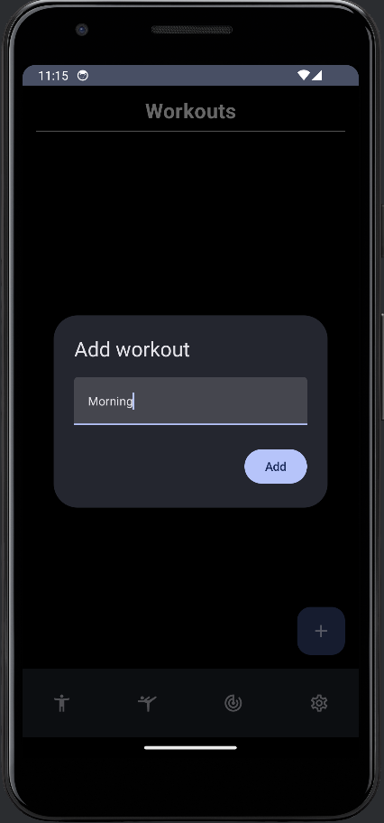

# Report

## Final Description of Application: Sport-Android-App

Our application is designed for keeping track of consumed protein per day with the ability to see the amount which is left and revise consumed products, including adding photos. The user can be notified about the protein consumption at the chosen time. Another important function is to observe exercises predefined in the application and create custom workouts. The application also allows you to record data about a person’s body measurements (Weight, Height, biceps size, and so on).

## Screenshots with Description

### Settings Page

**Description:** This page allows users to input their body measurements and set their daily protein intake goal. The information provided here will be used to calculate the user's protein intake progress.

### Update Measurement Dialog

**Description:** This dialog enables users to update their body measurements.

### Progress Page

**Description:** This page tracks the user's protein intake based on the products added on the Products page. It calculates the total protein intake and compares it to the user's set protein goal.

### Products Page

**Description:** This page displays products added by the user, including their names, photos, and protein content.

### Add Product Dialog

**Description:** This dialog allows users to add new products. Users can input the product's name, its protein content, and take a photo of it. All fields are mandatory.

### Notification

**Description:** This section demonstrates how notifications will appear. Users can set a specific time to be reminded to intake protein. Clicking on the notification redirects the user to the app.

### Main Exercises Page

**Description:** This page contains generic sections of exercises (strength, cardio, stretch). Clicking on each section redirects the user to a more specific category of exercises.

### Cardio Exercises Page

**Description:** This page displays specific cardio exercises such as running or cycling.

### Running Description/Image Pages

**Description:** Each exercise has a description and an attached photo to guide users on how to properly perform the exercise.

### Add Workout Dialog

**Description:** This dialog allows users to name their workout, for example, "Morning Workout."

### Choose Exercises for Workout Page

**Description:** This page displays all available exercises in the app. Users can add exercises to their workout by selecting the corresponding checkboxes.

### Overview of Selected Exercises in Workout

**Description:** This page provides an overview of the exercises the user has added to their workout.

## Description of Mobile Aspects Used in Application

The application utilizes various mobile aspects to enhance its functionality and user experience. Below are the key components:

- **Data Representation:** Room Database
- **UI Framework:** Jetpack Compose
- **Image Handling:** Glide Library
- **Notifications:** Implemented
- **Design Patterns:** Model-View-ViewModel (MVVM)
- **Architecture:** Three layers of hierarchy

### Software (SW) Aspects

- **Operating System:** Android
- **Language:** Kotlin
